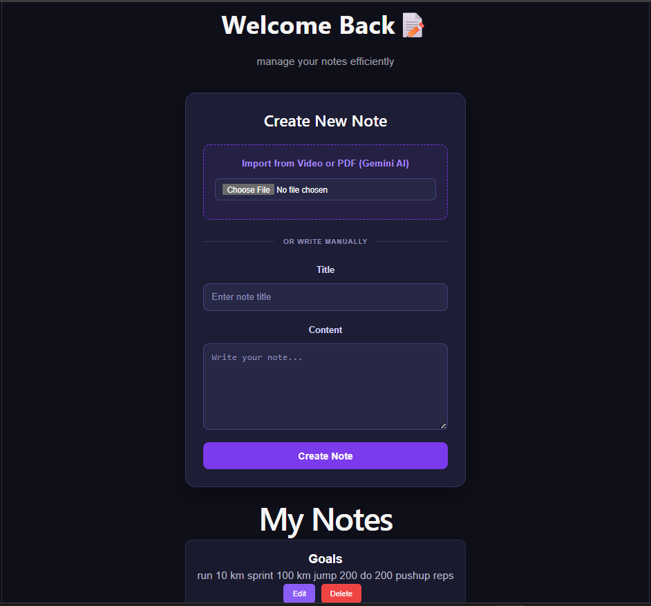

# 📝 NotesApp (with Gemini AI Integration)

<div align="center">

  <p align="center">
    <strong>A sleek, full-stack note-taking dashboard with real-time Markdown rendering and advanced AI document/video processing powered by Gemini 3.5 Flash.</strong>
  </p>

  <h4>
    <a href="#-overview">Overview</a> •
    <a href="#-preview">Preview</a> •
    <a href="#-ai-features">AI Features</a> •
    <a href="#-key-features">Key Features</a> •
    <a href="#-tech-stack">Tech Stack</a> •
    <a href="#-quick-start">Quick Start</a> •
    <a href="#-contributing">Contributing</a>
  </h4>

</div>

<hr />

## 🌟 Overview

**NotesApp** is a high-performance, developer-centric full-stack note-taking application. It combines a responsive React frontend with a robust Node/Express backend, utilizing MongoDB for secure note persistence. 

The highlight of NotesApp is its integration with the **Gemini AI API** (via the modern `@google/genai` SDK), allowing users to upload documents, PDFs, or even video files and automatically generate structured, study-ready Markdown notes.

---

## 📸 Preview

<div align="center">
  
</div>

---

## 🤖 Gemini AI Features

Transform your files and media into structured Markdown intelligence:

* 📄 **Document & PDF Summarization** — Upload any study material, textbook chapters, or research papers and get structured concept notes.
* 📝 **Step-by-Step Question Solver** — Select the "Question Paper" mode when uploading to automatically extract all questions and generate detailed, step-by-step solutions.
* 🎥 **Video Lecture Notes** — Upload video files directly to the Gemini File API to generate summaries, timestamps, and key topics discussed.
* ☁️ **Gemini File API Integration** — Seamlessly processes larger media files using Google's file streaming API.

---

## ⚡ Key Features

* ✍️ **Dual-Pane Markdown Editor** — Standard notes can be written using Markdown with live previews.
* 📌 **Priority Pinning** — Keep critical notes, daily logs, or checklists anchored at the top of your dashboard.
* 🔍 **Fuzzy-Search Index** — Instantly filter notes by title or content.
* 🔒 **JWT Authentication** — Complete user login and registration flow with encrypted password security.
* 🎨 **Modern Responsive UI** — Clean grid layouts, responsive panels, and a sleek dark theme.

---

## 🛠️ Tech Stack

### Frontend
- **React.js** (Vite build tool)
- **CSS3** (Fluid variables, responsive layout styling)
- **Axios** (API requests orchestration)

### Backend
- **Node.js** & **Express.js** (REST API)
- **MongoDB** & **Mongoose** (Data schema & persistence)
- **Multer** (File upload middleware)

### AI Engine
- **Google GenAI SDK** (`@google/genai`)
- **Model**: `gemini-3.5-flash`
- **API integrations**: Google File API upload & get, content generation.

```mermaid
graph TD
    A[React Dashboard] -->|User Uploads File| B[Express Backend]
    B -->|Upload to File API| C[Gemini File API]
    C -->|Processing| C
    C -->|File URI ready| D[Gemini 3.5 Flash Model]
    B -->|Generate notes prompt| D
    D -->|Markdown Output| B
    B -->|Persist note| E[(MongoDB)]
    B -->|Return JSON| A
